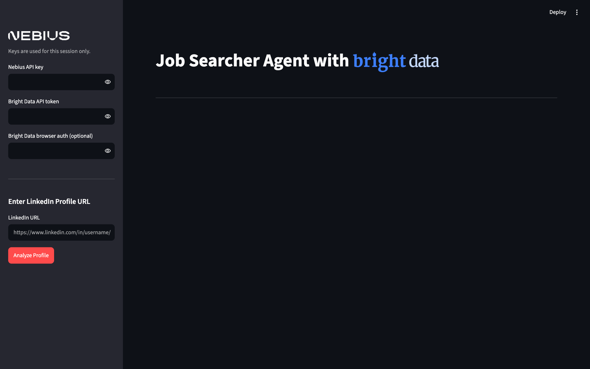

# Job Search Agent with Bright Data and Nebius Token Factory


👤 **Portfolio:** [s-harshni.github.io/S-Harshni](https://s-harshni.github.io/S-Harshni/)


A powerful AI-powered job search agent that analyzes LinkedIn profiles and finds relevant job opportunities using Bright Data for web scraping and Nebius Token Factory for intelligent analysis.

## Features

- LinkedIn Profile Analysis

  - Professional experience and career progression
  - Education and certifications
  - Core skills and expertise
  - Industry reputation

- Intelligent Job Matching

  - Domain classification (Software Engineering, Design, Product Management, etc.)
  - Y Combinator job board integration
  - Personalized job recommendations
  - Direct application links

- Modern Web Interface
  - Real-time analysis
  - Interactive results display
  - Progress tracking
  - Error handling

## Screenshot



## How it Works


## Prerequisites

Before running this project, make sure you have:

- Python 3.10 or higher
- Node.js 18+ (the Bright Data MCP server runs via `npx @brightdata/mcp`)
- A [Bright Data](https://brightdata.com/) account and API credentials
- [Nebius Token Factory](https://tokenfactory.nebius.com/) account and API key

## Project Structure

```
job_finder_agent/
├── app.py              # Streamlit web interface
├── job_agents.py       # AI agent definitions and analysis logic
├── mcp_server.py       # Bright Data MCP server management
├── requirements.txt    # Python dependencies
├── assets/            # Static assets (images, GIFs)
└── .env              # Environment variables (create this)
```

## Installation

1. Clone the repository:

```bash
git clone https://github.com/S-Harshni/Job-Search-Agent.git
cd Job-Search-Agent
```

2. Create a virtual environment:

```bash
python -m venv venv
source venv/bin/activate  # On Windows, use: venv\Scripts\activate
```

3. Install dependencies:

```bash
# Using pip
pip install -r requirements.txt

# Or using uv (recommended)
uv sync
```

## Configuration

Enter your keys in the app's sidebar. They're used for your session only. Alternatively, create a `.env` file (see `.env.example`) so you don't have to type them:

```
NEBIUS_API_KEY="Your Nebius API Key"
BRIGHT_DATA_API_KEY="Your Bright Data API Key"
BROWSER_AUTH=""   # optional: enables Bright Data's scraping-browser tools
```

## Usage

1. Start the application:

```bash
streamlit run app.py
```

2. Open your browser at http://localhost:8501

3. Enter your Nebius API key and Bright Data token in the sidebar

4. Input a LinkedIn profile URL to analyze

5. Click "Analyze Profile" and wait for results

## How It Works

1. **Profile Analysis**: The LinkedIn Profile Analyzer agent extracts key information from the provided LinkedIn profile.

2. **Domain Classification**: The Job Suggestions agent identifies the primary professional domain and confidence score.

3. **Job Matching**: The system searches Y Combinator's job board for relevant positions based on the identified domain.

4. **URL Processing**: Job application URLs are processed to provide direct application links.

5. **Summary Generation**: A comprehensive report is generated with profile analysis, skill assessment, and job recommendations.

## Technical Details

- Uses Streamlit for the web interface
- Implements asynchronous processing with asyncio
- Leverages Bright Data's MCP server for web scraping
- Utilizes Nebius Token Factory's Llama-3.3-70B-Instruct model for analysis
- Implements proper error handling and logging

## Changes in this version

- **Sidebar keys are used.** The Nebius key typed in the UI used to be ignored (the code read only `.env`). The Bright Data token can now be entered in the UI too.
- **`BROWSER_AUTH` is optional.** The MCP server used to crash on start without it.
- Each analysis starts its own MCP server with the visitor's credentials and closes it afterwards.
- Removed `asyncio` from `requirements.txt` (a Python 2-era PyPI package that breaks on Python 3) and added the missing `nest-asyncio`.

## Credits

Based on the Job Finder Agent from [Arindam Majumder's awesome-ai-apps](https://github.com/Arindam200/awesome-ai-apps) (demo GIFs from that project).

## Contributing

Contributions are welcome! Please feel free to submit a Pull Request.

## Acknowledgments

- [Bright Data](https://brightdata.com/) for web scraping capabilities
- [Nebius Token Factory](https://tokenfactory.nebius.com/) for AI model access
- [Streamlit](https://streamlit.io/) for the web interface framework
